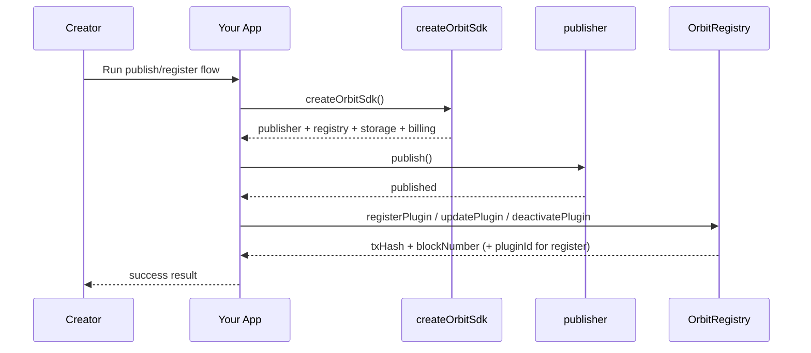
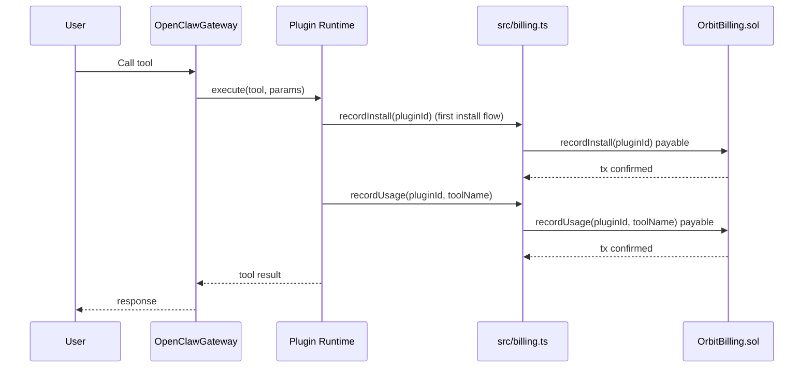

# Orbit SDK

This project is an SDK experiment for Orbit plugin monetization with real mode:
- on-chain registry and billing
- HTTP storage integration

## Features

- Register plugins to smart contract (`OrbitRegistry`)
- Update and deactivate plugin metadata through `OrbitRegistry`
- Publish plugin package to ClawHub
- Charge user install and usage through smart contract (`OrbitBilling`)
- Withdraw plugin earnings through `OrbitBilling`
- Store plugin context in Orbit storage endpoint
- Single SDK factory (`createOrbitSdk`) for `registry`, `publisher`, `billing`, and `storage`

## Main Structure

- `src/sdk.ts` factory for `registry`, `publisher`, `storage`, `billing`
- `src/registry.ts` real registry implementation + env/prompt loader
- `src/publisher.ts` ClawHub publishing implementation
- `src/billing.ts` real billing implementation
- `src/storage.ts` real storage implementation via HTTP
- `src/runtime_config.ts` env + interactive prompt runtime config loader
- `src/abis.ts` ABI definitions for Orbit contracts
- `src/types.ts` SDK types
- `src/index.ts` exports
- `orbit-contract/contracts/registry/v1/OrbitRegistry.sol` on-chain plugin registry
- `orbit-contract/contracts/billing/v1/OrbitBilling.sol` on-chain billing contract

## Creator Flow

Inside SDK usage:
- publish package via `publisher.publish(...)`
- register plugin via `registry.registerPlugin(...)`
- update plugin via `registry.updatePlugin(...)`
- deactivate plugin via `registry.deactivatePlugin(...)`

### Creator Sequence Diagram



## User Runtime Flow

Inside plugin runtime integration:
- first install flow triggers `recordInstall`
- every usage flow triggers `recordUsage`
- optional context persistence uses `storage.upload` and `storage.download`

### User Sequence Diagram



## Example End-to-End Flow

1. Creator sets Orbit env and deploys contracts.
2. Creator runs publish flow through `publisher.publish`.
3. App creates SDK with `createOrbitSdk`.
4. Creator registers plugin through `OrbitRegistry`.
5. User installs/uses plugin through gateway integration.
6. Runtime charges install and usage via `OrbitBilling`.
7. Creator later withdraws earnings from `OrbitBilling`.

## Environment Variables

Key variables:
- `ORBIT_RPC_URL` (or `RPC_URL`)
- `PRIVATE_KEY`
- `ORBIT_REGISTRY_ADDRESS`
- `ORBIT_BILLING_ADDRESS`
- `ORBIT_STORAGE_URL`
- `ORBIT_CHAIN_ID`
- `ORBIT_CHAIN_NAME`

If required values are not set and terminal is interactive, SDK runtime asks through QnA prompt.

## Usage

```ts
import { createOrbitSdk } from "orbit-sdk";

const sdk = createOrbitSdk();

await sdk.publisher.publish();
const receipt = await sdk.registry.registerPlugin({
  name: "my-plugin",
  version: "1.0.0",
  slug: "my-plugin",
  description: "plugin description",
  pricePerInstall: 1000000000000000n,
  pricePerUsage: 100000000000000n
});

await sdk.billing.recordInstall(receipt.pluginId);
await sdk.billing.recordUsage(receipt.pluginId, "toolName");
```

## Setup

```bash
npm install
npm run build
```
