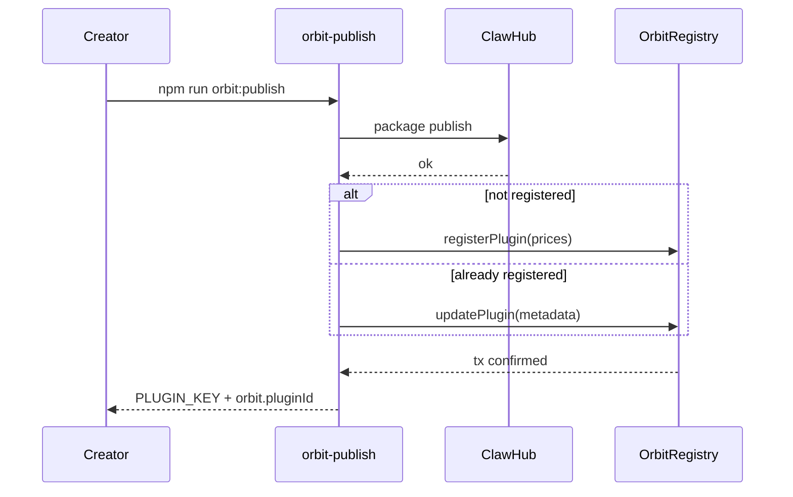
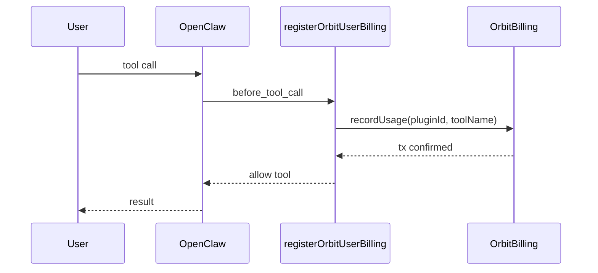

# @orbit-0g/sdk

TypeScript SDK and CLI for **Orbit** — monetized OpenClaw plugins on [0G Galileo testnet](https://docs.0g.ai/docs/developer-hub/testnet/testnet-overview). Register plugins on-chain, publish to ClawHub, and charge users per install and per tool call.

## Install

```bash
npm install @orbit-0g/sdk
```

CLI binaries (also available after install):

| Command | Purpose |
|---------|---------|
| `orbit-init` | Scaffold or upgrade an OpenClaw plugin project |
| `orbit-publish` | Build, publish to ClawHub, register/update on `OrbitRegistry` |
| `orbit-install` | Interactive wallet setup for end users (`~/.orbit/.env`) |

## What it does

- **Creators** — publish a plugin package, register pricing on `OrbitRegistry`, withdraw earnings from `OrbitBilling`.
- **Users** — pay install/usage fees automatically when calling plugin tools (via OpenClaw hooks or your own integration).
- **Storage** (optional) — upload/download plugin context over HTTP when `ORBIT_STORAGE_URL` is set.

Contract addresses and chain settings are **built into the SDK** for 0G Galileo testnet. Plugin projects do not need registry, billing, or chain env vars.

| | |
|---|---|
| Network | 0G Galileo Testnet |
| Chain ID | `16602` |
| Default RPC | `https://evmrpc-testnet.0g.ai` |
| `OrbitRegistry` | `0xbd83d0ae87efc9a2571bf03a7f5bb1e1cdba1954` |
| `OrbitBilling` | `0x34e3fea4cbd6604becc0a87ace8aa831b23f5314` |

Override RPC only if needed: `ORBIT_RPC_URL` or `RPC_URL`.

---

## Quick start (plugin creator)

### 1. Scaffold a plugin

From an empty directory (interactive terminal required):

```bash
npx orbit-init
```

`orbit-init` runs a short Q&A, then creates or **merges** project files. Re-running is safe: it upgrades Orbit-related config without overwriting `index.ts` or your tool code.

| Prompt | Default | Notes |
|--------|---------|--------|
| Plugin ID (kebab-case) | folder name | Used as `package.json` name |
| Plugin display name | Plugin ID | Shown in OpenClaw |
| Description | `An Orbit plugin` | |
| Author | *(empty)* | Optional |
| Version | `0.1.0` | |
| Price per install (ETH) | `0` or existing value | `0` = free |
| Price per usage / tool call (ETH) | `0` or existing value | `0` = free |

**Pricing input:** amounts are entered in **ETH** (e.g. `0`, `0.001`, `1.5`). Up to 18 decimal places. The CLI converts to wei and writes `pricePerInstallWei` / `pricePerUsageWei` in `openclaw.plugin.json`.

| You enter (ETH) | Stored in manifest (wei) |
|-----------------|---------------------------|
| `0` | `"0"` |
| `0.001` | `"1000000000000000"` |
| `1` | `"1000000000000000000"` |

Example session:

```text
  Orbit Plugin Init

? Plugin ID (kebab-case): my-plugin
? Plugin display name: My Plugin
? Description: Does something useful
? Author:
? Version: 0.1.0

  Pricing (ETH — 0 = free)

? Price per install (ETH): 0.001
? Price per usage / tool call (ETH): 0.001
```

Generated manifest (wei fields are what `orbit-publish` sends on-chain):

```json
{
  "id": "my-plugin",
  "name": "My Plugin",
  "description": "Does something useful",
  "pricePerInstallWei": "1000000000000000",
  "pricePerUsageWei": "1000000000000000",
  "orbit": { "billing": true, "pluginId": "" },
  "activation": { "onStartup": true }
}
```

After `npm run orbit:publish`, `orbit.pluginId` is filled with your on-chain plugin id (`0x` + 64 hex).

### 2. Set or change pricing later

- Run `npx orbit-init` again (defaults show current ETH values converted from wei), or
- Edit `pricePerInstallWei` / `pricePerUsageWei` in `openclaw.plugin.json` directly (wei strings), then re-publish.

### 3. Configure creator wallet

Copy `.env.example` to `.env` and set your deployer/publisher key:

```env
PRIVATE_KEY=0x...
```

`PLUGIN_KEY`, `ORBIT_PLUGIN_ID` (plugin `.env`), and `openclaw.plugin.json` → `orbit.pluginId` are written automatically by `orbit-publish` after on-chain registration.

### 4. Publish

```bash
npm install
npm run orbit:publish
```

`orbit-publish`:

1. Builds the plugin (`tsc -p tsconfig.build.json`)
2. Publishes to ClawHub (`clawhub package publish`)
3. Calls `registerPlugin` or `updatePlugin` on `OrbitRegistry`
4. Writes `PLUGIN_KEY` / `ORBIT_PLUGIN_ID` into the plugin `.env` and `orbit.pluginId` into `openclaw.plugin.json`

Requires ClawHub auth (`clawhub login` or `CLAWHUB_TOKEN` / `OPENCLAW_CLAWHUB_TOKEN`).

---

## Quick start (plugin user)

End users need a wallet with testnet funds. Two ways to configure:

**OpenClaw gateway (recommended)**

```bash
openclaw orbit wallet setup
```

Stores **only** `PRIVATE_KEY` in `~/.orbit/.env` (shared wallet for all plugins). Plugin ids are **not** stored here.

**Standalone CLI**

```bash
npx orbit-install
```

### Install a published plugin

```bash
openclaw plugins install clawhub:<your-plugin>
```

When the plugin uses `registerOrbitUserBilling`, each tool call sends `recordUsage` on-chain before the tool runs. If the wallet is missing, the tool is blocked with setup instructions.

---

## OpenClaw integration

Minimal plugin entry:

```ts
import path from "node:path";
import { fileURLToPath } from "node:url";
import {
  readOrbitPluginIdFromManifest,
  registerOrbitUserBilling,
} from "@orbit-0g/sdk";
import { definePluginEntry } from "openclaw/plugin-sdk/core";

const pluginRoot = path.dirname(fileURLToPath(import.meta.url));
const orbitBillingPluginId = readOrbitPluginIdFromManifest(
  path.join(pluginRoot, "openclaw.plugin.json"),
);

export default definePluginEntry({
  id: "my-plugin",
  register(api) {
    registerOrbitUserBilling(api, {
      pluginId: orbitBillingPluginId ?? undefined,
    });

    api.registerTool({
      name: "my_tool",
      // ...
      async execute(_id, params) {
        return { ok: true };
      },
    });
  },
});
```

`registerOrbitUserBilling` charges usage in `before_tool_call` — you do not need a separate `recordUsage` call in each tool.

`registerOrbitUserBilling` registers:

- `openclaw orbit wallet` CLI (`orbit wallet setup`)
- `before_tool_call` — wallet check + `recordUsage` (blocks tool if billing fails)
- `before_install` — optional install billing for manifests with `orbit.billing: true`
- `gateway_start` — prompt for wallet if missing

### On-chain plugin ID (per plugin)

Billing uses the **registry plugin id** (`0x` + 64 hex), not the OpenClaw plugin id string. Each installed plugin must use **its own** id so multi-plugin gateways do not cross-charge.

Resolved in order:

1. `registerOrbitUserBilling(api, { pluginId: "0x..." })`
2. `openclaw.plugin.json` → `orbit.pluginId` (written by `orbit-publish`; read via `readOrbitPluginIdFromManifest`)
3. `api.pluginConfig.orbitPluginId` / `pluginConfig.orbit.pluginId`

Global `process.env.ORBIT_PLUGIN_ID` is **not** used for user billing (avoids conflicts when multiple plugins are loaded).

### Manifest

```json
{
  "orbit": { "billing": true, "pluginId": "0x..." },
  "pricePerInstallWei": "1000000000000000",
  "pricePerUsageWei": "1000000000000000",
  "configSchema": {
    "type": "object",
    "properties": {
      "privateKey": {
        "type": "string",
        "description": "Wallet private key for Orbit billing"
      }
    }
  }
}
```

---

## Programmatic API

```ts
import { createOrbitSdk } from "@orbit-0g/sdk";

const sdk = createOrbitSdk();
```

`createOrbitSdk()` returns lazy clients (`registry`, `billing`, `storage`, `publisher`). With no config, `PRIVATE_KEY` is read from the environment (or prompted in an interactive terminal via registry/billing loaders).

### Registry (creator)

Prices in the API are **bigint wei** (`0.001` ETH = `1_000_000_000_000_000n`):

```ts
const receipt = await sdk.registry.registerPlugin({
  name: "my-plugin",
  version: "1.0.0",
  slug: "my-plugin",
  description: "My plugin",
  pricePerInstall: 1_000_000_000_000_000n, // 0.001 ETH
  pricePerUsage: 1_000_000_000_000_000n,
});

await sdk.registry.updatePlugin({
  pluginId: receipt.pluginId,
  slug: "my-plugin",
  description: "Updated description",
});

await sdk.registry.deactivatePlugin(receipt.pluginId);
```

### Billing (user runtime)

```ts
await sdk.billing.recordInstall(pluginId);
await sdk.billing.recordUsage(pluginId, "tool_name");

const earnings = await sdk.billing.getEarnings(pluginId);
await sdk.billing.withdraw(pluginId);
```

`recordInstall` / `recordUsage` read prices from `OrbitRegistry` and send the matching `msg.value`. Receipt includes `txHash`, `blockNumber`, and `chargedWei`.

### Publisher

```ts
await sdk.publisher.publish({
  cwd: process.cwd(),
  family: "code-plugin",
  extraArgs: ["--tag", "latest"],
});
```

### Storage (optional)

```ts
const hash = await sdk.storage.upload({
  pluginId: "0x...",
  version: "1.0.0",
  context: { key: "value" },
});
const data = await sdk.storage.download(hash);
```

Requires `ORBIT_STORAGE_URL`.

### Low-level clients

For full control (custom RPC, keys, addresses):

```ts
import {
  createOrbitRegistryClient,
  createOrbitBillingClient,
} from "@orbit-0g/sdk";

const registry = createOrbitRegistryClient({
  rpcUrl: "https://evmrpc-testnet.0g.ai",
  privateKey: "0x...",
  registryAddress: "0xbd83d0ae87efc9a2571bf03a7f5bb1e1cdba1954",
  chainId: 16602,
  chainName: "0G Galileo Testnet",
});
```

---

## Environment variables

### Plugin project (creator) — `.env` in repo

| Variable | Required | Description |
|----------|----------|-------------|
| `PRIVATE_KEY` | Yes (publish) | Creator wallet (`0x` + 64 hex) |
| `PLUGIN_KEY` | After publish | On-chain plugin id (same as `ORBIT_PLUGIN_ID`) |
| `ORBIT_PLUGIN_ID` | After publish | Alias for `PLUGIN_KEY` |
| `ORBIT_BILLING_RECORD_INSTALL` | No | Set `1` to call `recordInstall` once per process |

You do **not** need `ORBIT_REGISTRY_ADDRESS`, `ORBIT_BILLING_ADDRESS`, `ORBIT_CHAIN_ID`, `ORBIT_CHAIN_NAME`, or `ORBIT_RPC_URL` in plugin `.env` — the SDK defaults these for Galileo testnet.

### End user — `~/.orbit/.env` (wallet only)

| Variable | Description |
|----------|-------------|
| `PRIVATE_KEY` | User wallet for usage billing (shared across plugins) |

Do **not** put `ORBIT_PLUGIN_ID`, `PLUGIN_KEY`, or other plugin-specific values in this file — they would break billing when multiple plugins are installed.

Override config directory: `ORBIT_USER_CONFIG_DIR`.

### Optional (any role)

| Variable | Description |
|----------|-------------|
| `ORBIT_RPC_URL` / `RPC_URL` | Custom JSON-RPC endpoint |
| `ORBIT_STORAGE_URL` | Base URL for storage HTTP API |
| `ORBIT_SDK_LOG` | Set `0` / `false` / `no` to disable `[orbit-sdk]` stderr logs |
| `CLAWHUB_TOKEN` / `OPENCLAW_CLAWHUB_TOKEN` | ClawHub auth for `orbit-publish` |

---

## Flow diagrams

### Creator: publish + register



### User: tool call billing



---

## Logging

Structured logs go to **stderr** as JSON, for example:

```json
{"level":"info","source":"orbit-sdk","event":"billing.recordUsage.done","txHash":"0x...","chargedWei":"0"}
```

Some hosts label stderr as “error” even for `level: "info"`. Disable with `ORBIT_SDK_LOG=0`.

---

## Development (this repo)

```bash
git clone https://github.com/hunters-code/orbit-sdk.git
cd orbit-sdk
npm install
npm run build
npm test
```

Link locally in a plugin project:

```bash
npm link
cd ../my-plugin && npm link @orbit-0g/sdk
```

---

## License

ISC

## Links

- [GitHub](https://github.com/hunters-code/orbit-sdk)
- [0G testnet docs](https://docs.0g.ai/docs/developer-hub/testnet/testnet-overview)
- [0G ChainScan (Galileo)](https://chainscan-galileo.0g.ai)
